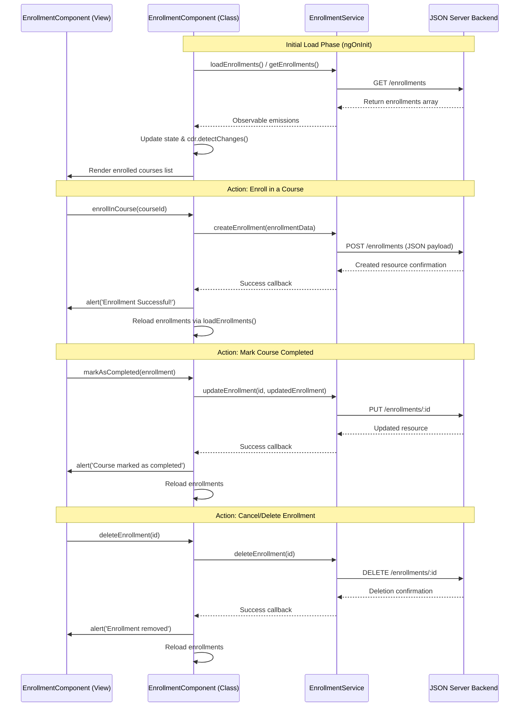

# Smart Learning Management System - Angular & TypeScript Interview Prep

This guide contains the workflow documentation for the Enrollment system and a set of 10 essential interview questions (with detailed answers) mapping directly to concepts and patterns implemented in this codebase.

---

## 1. Enrollment Workflow & Component/Service Architecture

### Enrollment Workflow Diagram & Stages


### Roles of Functions in [enrollment.ts (Service)](file:///c:/Users/visha/Desktop/Capg/smart-learning-management-system/frontend/src/app/services/enrollment.ts)
The `EnrollmentService` acts as the data-access layer. It wraps Angular's `HttpClient` to manage CRUD operations with the JSON server (`/enrollments` endpoint):
* **`getEnrollments()`**: Sends a `GET` request to retrieve all student enrollments. Returns an `Observable<any[]>`.
* **`getEnrollment(id: number)`**: Sends a `GET` request to retrieve a single enrollment record by its unique ID.
* **`createEnrollment(enrollment: any)`**: Sends a `POST` request to register a student for a course. It expects a payload including `userId`, `courseId`, `batchId`, and `status`.
* **`updateEnrollment(id, enrollment: any)`**: Sends a `PUT` request to update an existing enrollment record. Useful for updating the status (e.g. changing status from `'enrolled'` to `'completed'`).
* **`deleteEnrollment(id: number)`**: Sends a `DELETE` request to remove/cancel an enrollment record.

### Roles of Functions in [enrollment.ts (Component Page)](file:///c:/Users/visha/Desktop/Capg/smart-learning-management-system/frontend/src/app/pages/student/enrollment/enrollment.ts)
The `EnrollmentComponent` acts as the Controller orchestrating state management and handling user interactions:
* **`ngOnInit()`**: A lifecycle hook executed after Angular has initialized all data-bound properties. It serves as the starting point for fetching initial datasets by invoking loaders for enrollments, courses, categories, and instructors.
* **`loadEnrollments() / loadCourses() / loadCategories() / loadInstructors()`**: These functions subscribe to their respective services, unpack the returned array collections, assign them to local arrays, and call `cdr.detectChanges()` to update the DOM immediately.
* **Helper Functions (`getCategoryName`, `getInstructorName`, `getCourseTitle`)**: Local mapper functions that resolve ID-based relationships in the template to display human-readable strings (e.g., matching a course's `categoryId` with its category title).
* **`enrollInCourse(courseId: number)`**: Prepares the payload data structure (e.g. default `userId: 1`, `batchId: 1`, and status `'enrolled'`) and calls `createEnrollment()` in the service. Reloads the current view on success.
* **`markAsCompleted(enrollment: any)`**: Clones the existing enrollment record, alters the status property to `'completed'`, calls the service's `updateEnrollment()`, and triggers a view reload.
* **`deleteEnrollment(id: number)`**: Displays a browser confirm prompt. On positive user feedback, calls the service's `deleteEnrollment()` and refreshes the lists.

---

## 2. Top 10 Angular & TypeScript Conceptual Questions

### Q1: What are Standalone Components in Angular, and how do they differ from NgModule-based components? How are they configured in this project?
**Answer:**  
Standalone components (introduced in Angular 14/15) eliminate the need to declare components in an `NgModule`. They are self-contained: they manage their own template imports directly.
* **Differences**: Standalone components have `standalone: true` set inside the `@Component` decorator metadata. Rather than relying on an NgModule to import dependencies (like `CommonModule` or `FormsModule`), standalone components declare their dependencies directly in their `imports` array.
* **Project Example**: 
  ```typescript
  @Component({
    selector: 'app-enrollment',
    standalone: true, // Configures it as a standalone component
    imports: [
      CommonModule, 
      FormsModule, 
      Sidebar, 
      Header
    ],
    templateUrl: './enrollment.html',
    styleUrl: './enrollment.css'
  })
  export class EnrollmentComponent { ... }
  ```

### Q2: What is Dependency Injection (DI) in Angular, and what are the two main ways services are injected in this project?
**Answer:**  
Dependency Injection is a design pattern in Angular where a class requests dependencies (like services) from external sources rather than creating them itself. 
Our project uses the two key injection approaches:
1. **Constructor Injection**: Injecting dependencies as private parameters in the constructor.
   ```typescript
   constructor(
     private enrollmentService: EnrollmentService,
     private courseService: CourseService
   ) {}
   ```
2. **The `inject()` Function**: Used in newer components and standalone files to inject tokens dynamically.
   ```typescript
   private route = inject(ActivatedRoute);
   private router = inject(Router);
   private assessmentService = inject(AssessmentService);
   ```

### Q3: Explain the role of the `@Injectable({ providedIn: 'root' })` decorator. What does `providedIn: 'root'` accomplish?
**Answer:**  
The `@Injectable` decorator marks a class as available to be injected as a dependency. The `{ providedIn: 'root' }` configuration specifies that the service should be registered with the root application injector.
* **Benefits**: 
  * It creates a **singleton** instance of the service that is shared globally across the entire app.
  * It enables **tree-shaking**: if the service is never imported or used anywhere in the application, the compiler can exclude it from the final production bundle, reducing bundle size.

### Q4: What are Angular Signals (`signal`), and how do they differ from RxJS Observables? Give an example of signal usage from this project.
**Answer:**  
Angular Signals (introduced in Angular 16) represent reactive values that provide synchronous, glitch-free propagation of change notification.
* **Signals vs. Observables**:
  * **Signals** are designed specifically for template-based state tracking. They always have an initial value, can be read synchronously by executing the signal name as a function (e.g. `loading()`), and don't require manual subscription/unsubscription cleanup.
  * **Observables** (RxJS) are designed for asynchronous stream processing, event orchestration, and HTTP calls. They do not have an initial value by default and must be subscribed to (`.subscribe()`).
* **Project Example** (from `assessment.ts`):
  ```typescript
  loading = signal(true); // Initializing signal
  
  // Updating value
  this.loading.set(false); 
  
  // Reading value in HTML/TS
  if (this.loading()) { ... }
  ```

### Q5: What is the purpose of `ChangeDetectorRef` and the `detectChanges()` method? Why is it manually called in `enrollment.ts`?
**Answer:**  
`ChangeDetectorRef` provides access to Angular's change detection mechanism. The `detectChanges()` method forces Angular to immediately run change detection on this component and its children.
* **Why it is used here**: Angular 21 with specific compilation modes (like zone-less or when running inside mock/asynchronous test boundaries) may not automatically capture array reference re-assignments in asynchronous subscription callbacks. Calling `this.cdr.detectChanges()` manually ensures the UI immediately updates and re-renders when data arrives from the backend server.

### Q6: What is RxJS `forkJoin`, and why is it preferred over nested subscriptions when dealing with multiple HTTP requests?
**Answer:**  
`forkJoin` is a creation operator that accepts an object or array of Observables and waits for all of them to complete. Once they all complete, it emits a single object/array containing the last emitted value from each Observable.
* **Why it's preferred**: It runs requests in parallel (concurrently) rather than sequentially (which avoids "callback hell" / nested subscriptions) and guarantees all datasets are fully loaded before executing downstream logic.
* **Project Example** (from `dashboard-stats.ts`):
  ```typescript
  forkJoin({
    progressList: this.progressService.getByUserId(1),
    courses: this.http.get<any[]>('http://localhost:3000/courses')
  }).subscribe({
    next: ({ progressList, courses }) => {
      // Both datasets are guaranteed to be populated here
    }
  });
  ```

### Q7: Explain the difference between Reactive Forms and Template-Driven Forms. Which one is used for the assessment features, and how is it built?
**Answer:**  
* **Template-Driven Forms** (using `ngModel`): Rely on directives in the template to create and manage the form model. Best for simple, static forms.
* **Reactive Forms**: Rely on explicit form group and control definitions in the TypeScript class. Best for dynamic, complex validation scenarios.
* **Project Example** (from [assessment.ts](file:///c:/Users/visha/Desktop/Capg/smart-learning-management-system/frontend/src/app/features/assessment/assessment/assessment.ts)): Reactive forms are used to dynamically build questions. Because questions are loaded asynchronously from the database, we define an empty `FormGroup` and dynamically inject controls based on the returned database payload:
  ```typescript
  form = new FormGroup({});
  
  // Inside subscribe:
  qs.forEach(q => {
    this.form.addControl('q_' + q.id, new FormControl('', Validators.required));
  });
  ```

### Q8: What are TypeScript interfaces/types, and why should we avoid using `any`? How did we clean up type-casting in this project?
**Answer:**  
* **Interfaces/Types** (e.g. `Course`, `User`, `Profile`): Provide compile-time static type-checking, structural contract validation, and IDE autocompletion.
* **Why avoid `any`**: The `any` type disables compiler type-checking, defeating the safety benefits of using TypeScript and potentially hiding runtime bugs (like calling a typoed property).
* **Project Example**: In `course.selectors.ts`, state slices returned by NgRx feature selectors were typed, but compiler warnings arose from dictionary mappings. We cleaned this up by casting the NgRx store state explicitly to `@ngrx/entity`'s `Dictionary<Course>` and `Course[]` to enforce strict type contracts:
  ```typescript
  (entities: any, selectedId) => {
    const coursesDict = entities as Dictionary<Course>;
    return selectedId ? coursesDict[selectedId] || null : null;
  }
  ```

### Q9: How does routing parameter extraction work in Angular standalone components (e.g., fetching a course/assessment ID from a URL segment)?
**Answer:**  
To extract parameters from a route segment (such as `/assessment/:id`), we inject `ActivatedRoute` and read the snapshot path values:
* **Project Example** (from `assessment.ts`):
  ```typescript
  private route = inject(ActivatedRoute);
  
  ngOnInit(): void {
    // Accessing parameter synchronously using snapshot:
    const id = Number(this.route.snapshot.paramMap.get('id'));
  }
  ```
* *Alternative*: If the component could stay active while route parameters change, subscribing to `this.route.paramMap` Observable is preferred over using the snapshot.

### Q10: What is the purpose of NgRx Store DevTools, and how is the state initialized in `app.config.ts`?
**Answer:**  
* **NgRx Store DevTools**: Provides a visual instrument panel in the browser to inspect action history, track state mutations, and perform "time-travel debugging" (stepping backward and forward through state transitions).
* **State Initialization**: The root application config registers NgRx store providers using `provideStore(...)` and registers async operations (side effects) with `provideEffects(...)`:
  ```typescript
  export const appConfig: ApplicationConfig = {
    providers: [
      provideStore({
        courses: courseReducer // Registers course state reducer
      }),
      provideEffects([
        CourseEffects // Registers course loading side-effects
      ])
    ]
  };
  ```

---
*Good luck with your interview! This guide has been successfully saved in your workspace folder at `frontend/angular-interview-prep.md` for offline reference.*
